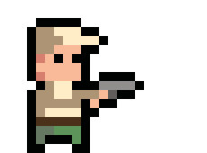
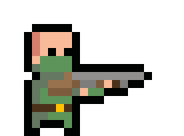
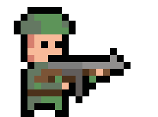
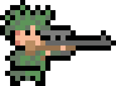
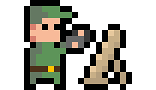

# Hex-game (Noname)

A turn-based strategy game with a pixel art top view. The game will take place on hexagonal cells in different terrains. Each cell has its own buffs and debuffs. It will be possible to change the terrain by digging trenches, building fortifications or strategic buildings.

## Plains and forests 0.1
Standard location for combat operations on plains and forests

**Example of map:**

**Cells buffs and debuffs:**

| Name        | Desscription           | Sprite     |
|--------------|----------------|--------------|
| Plain  | Simple cells without additional features         |  |
| Plain 2 | Simple cells without additional features         |  |
| Shrubs  | A cell with bushes where an army can hide and reduce its detection by 1 cell.         |  |
| Forest  | Forest. While in the forest, all troops reduce their detection distance by 2 cells         |   |
| Lake  | We'll have to go around it, it hinders movement        |   |

## Defense structures 0.2

Structures for the construction and fortification of combat positions, as well as obstacles for enemy troops.

**Sprites:**

1. Trench - a reliable shelter for infantry, where they can wait out the shelling or conduct defensive actions.
   - Level 1: -50% damage from infantry at a distance of more than 2 square, -15% damage from shelling, maximum capacity of 3 soldiers
   - Level 2: Infantry cannot be hit at a distance of more than 2 square, -25% damage from shelling, maximum capacity of 5 soldiers
   - Level 3: Infantry cannot be hit at a distance of more than 1 square, -40% damage from shelling, maximum capacity of 8 soldiers
  
2. Machine gun crew - very effective on the battlefield, can fire suppressive. Have an extended range of destruction.
   - Level 1: -15% damage from infantry, +1 cell attack distanse, +30% damage from shelling 
   - Level 2: -25% damage from infantry, +1 cell attack distanse, +20% damage from shelling
   - Level 3: -50% damage from infantry, +2 cell attack distanse, +10% damage from shelling

3. Reconnaissance tower -  facilitates surveillance of the territory, allows snipers to make longer shots and increases their accuracy.
   - Level 1: 4 cells visabilliity, +15% accurancy 
   - Level 2: 5 cells visabilliity, +20% accurancy 
   - Level 3: 6 cells visabilliity, +25% accurancy
  
4. Barbed wire - delays infantry for one turn and deals 20% damage, can be run over by vehicles.
5. Anti-tank hedgehogs - do not allow vehicles to pass, but infantry can cross them. Can be broken by infantry sabotage.
6. Minefield - visible only to the owner, blows up 1-5 infantry units or 1-2 vehicles.

## Buildings 0.3

In addition to defensive structures, you can also build strategic buildings, as: Barracks, Factories, and Cities. Within a 3-cell radius of factories and barracks, empty cells belonging to the player provide 1 point for army construction. Some structures have additional points (Cities, forests, lakes). Build a strong economy for victory!

**Base**
The base is the main goal, and when it is destroyed or captured, the game ends. Protect it until the last fighter is left.

**Barracks**
| Level 1      | Level 2      | Level 3      |
|------------------|------------------|------------------|
| |  |  |
| 
Price: coming soon Produce: soon HP: soon
 | 
Price: coming soon Produce: soon HP: soon
 | 
Price: coming soon Produce: soon HP: soon
 |

**Factory**
| Level 1      | Level 2      | Level 3      |
|------------------|------------------|------------------|
| |  |  |
| 
Price: coming soon Produce: soon HP: soon
 | 
Price: coming soon Produce: soon HP: soon
 | 
Price: coming soon Produce: soon HP: soon
 |

**City**
| Level 1      | Level 2      | Level 3      |
|------------------|------------------|------------------|
| |  |  |
| 
Price: coming soon Produce: soon HP: soon
 | 
Price: coming soon Produce: soon HP: soon
 | 
Price: coming soon Produce: soon HP: soon
 |

## Select and Upgrade 0.3
<table style="border-collapse: collapse;">
  <tr>
    <td style="border: none;">The ability to select cells and further interact with them has been added. When you click on a cell, a menu appears with a choice of what you want to build.    Menu:  ㅤ▹ㅤLogistic structures  ㅤ▹ㅤDefense structures ㅤ▹ㅤObstacles and trapsb   
Buid menu:  
Contains information about the structure, its capabilities, and price.     
Interaction menu:  Contains buttons for interacting with structures, as well as information about the next improvement of the structure.  
ㅤ▹ㅤDestroy structure   ㅤ▹ㅤReplace (trench) / produce  
ㅤ▹ㅤUpgrade structure
</td>
    <td style="border: none;">
    
    </td>
  </tr>
</table>

## Infantry 0.4

<h3 align="center"> <b>Barracks</b> </h3>

|      |       |       |       |       |
|------------------|------------------|------------------|------------------|------------------|
|  **Recruit** | **Shotgun-man** | **Rifle-man** | **Bazooka-man** | **Sniper** |

<h3 align="center"> <b>Factory</b> </h3>

|      |       |       |       |       |
|------------------|------------------|------------------|------------------|------------------|
|  **Scouting car** | **Mortar-man** | **APC** | **Anti-tank cannon** | **Tank** |

